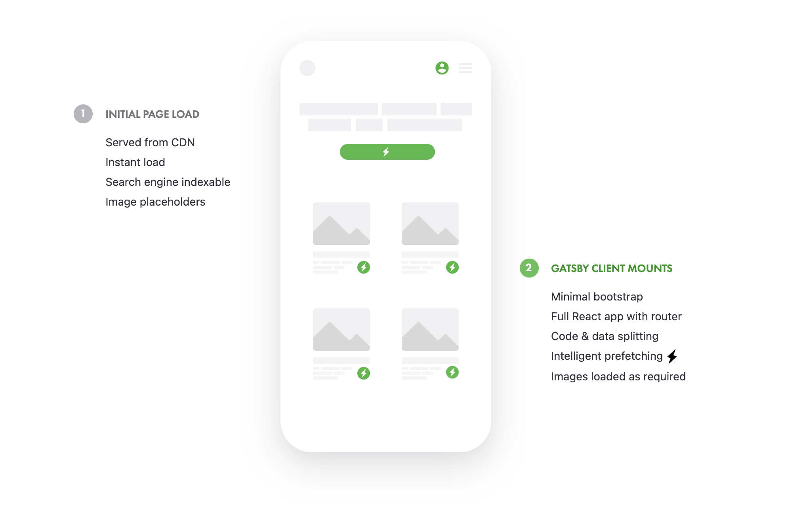

최근 제가 공부했던 것과 발생한 문제들을 기록하고 싶다는 생각이 들었던 참이라, 저만의 기술 블로그를 만들어 보며 Gatsby에 대해 알아가는 시간을 가져 보았습니다. 개발 3일차, 타이핑 속도가 현저히 낮아졌다고 생각한 지금 Gatsby에 대해 좀 더 자세히 알아봐야겠다는 생각이 들었습니다. (제가 이 글을 쓰고 있는 이유이기도 하죠) 그럼 Gatsby 공식 문서와 여러 자료들을 찾아보고 제 나름대로 정리해보며 Gatsby를 좀 더 잘 이해해보도록 하겠습니다! 😆

## Gatsby의 특징

무언가 결정을 할 때, 스스로에게 '왜'라는 질문을 던지는 것이 참 중요하다고 생각합니다. 아무 이유 없이 결정하는 수동적인 태도가 싫기도 하고 무엇보다 '왜'라는 질문으로 내가 무엇을 알고 무엇이 부족한지 확실하게 알게 되기 때문입니다. 제가 Gatsby를 왜 쓰려고 하는지와 함께 중요 개념들을 체크하는 시간을 가져보도록 하겠습니다.

### React 기반 SSG 프레임워크

React에 더 익숙했던 저는 React 기반 정적 사이트 생성기인 Next.js와 Gatsby 중 하나를 선택해야 했습니다. 두 프레임워크 모두 SSG로서 손색이 없다는 후기를 읽기도 했고 Gatsby 프로젝트에서 Next.js 프로젝트로 마이그레이션이 가능하다고 하여, 우선 Gatsby를 선택하였습니다.

### Gatsby는 Jamstack

제가 만들 블로그는 정적 사이트인 만큼 더 빠른 속도를 원했습니다. 웹사이트의 속도를 올리는 방안이 Jamstack이 전부는 아니지만 큰 요인 중에 하나라고 생각합니다. 이러한 이유로 저는 최신 아키텍처인 Jamstack로 블로그를 구성하고자 했고, Gatsby는 이를 편하게 이뤄줄 수 있었습니다.

> #### Jamstack이란?
>
> Jamstack은 Javascript, API, Markup로만 이뤄진 최신 웹 구성 방식을 말합니다. Jamstack으로 구성된 웹은 기존보더 더 빠르고, 더 안전합니다. Jamstack을 사용하면 마크업 요소들과 다양한 API를 이용하여 사전에 만들어 놓은 페이지를 CDN을 통해 열람할 수 있습니다.

### Gatsby와 검색 엔진 최적화(SEO)

블로그는 많은 사람들이 보기 위해서 SEO가 필수적이라고 생각했습니다. 결론적으로 Gatsby로 정적페이지를 만들어내면 SEO에 유리했죠. Jamstack을 이용한 정적페이지는 SSR을 생각할 이유가 없습니다. Build-time에 정적 HTML을 만들어 내기 때문에 첫 화면에 의미있는 HTML을 빠른 속도로 로드할 수 있기 때문입니다.

## Gatsby의 동작 과정

이미지나 폰트, 자바스크립트, 스타일시트 등 HTML 문서는 다양한 리소스를 가지고 웹페이지를 만들어내기 때문에 이 리소스를 미리 다운로드 해야합니다. 불필요한 스트립트를 제거하거나 외부 CDN 폰트 대신 자체 호스트하는 것이 성능 최적화에 도움이 된다고 공식 문서에 적혀 있듯이 이 리소스를 줄이는 것이 굉장히 중요한 것이죠. 그렇기 때문에 이미지 크기를 줄이고 코드를 압축하는 등 대역폭을 아끼려고 하고 한번 다운받은 파일을 브라우저가 재사용하도록 캐쉬를 사용하기도 합니다. 그리고 개츠비도 이 웹 페이지 로딩 시간을 줄이기 위해서 다양한 노력들을 합니다.

### 이미지 플러그인

`gatsby-plugin-image`는 이미지 로딩 성능을 최적화하기 위해서 개츠비가 공식적으로 소개하는 플러그인입니다. 이미지를 가져올 때 리소스 혼잡을 피하기 위해서 이미지에 대해서 필수적이지 않은 작업을 나중으로 미루는 대신 이미지를 가져올 동안 placeholder 제공하는 방식입니다. 물론 이미지 파일 크기 자체도 최소화합니다. 한마디로 문서를 더 빨리 읽는 것이 이미지를 가져오는 것보다 더 중요하다는 철학인 것이죠.

### 코드분할

웹팩은 모듈 의존성에 따라 코드를 분할하는 기능을 가지고 있는데 이를 코드 분할이라고 부릅니다. 개츠비는 이 기능을 이용해서 페이지 단위로 코드를 분할하고 이것을 청크라고 부릅니다. build를 하면 public 디렉토리에 페이지 별로 page-data.js이 생기는데 페이지 별로 필요한 청크 목록을 이곳에 담아둡니다.

### Preload

Preload는 렌더링이 도중에 차단되지 않기 위해서 자바스크립트 등의 파일을 미리 다운로드 받는 것을 말합니다. build 결과물을 확인해보면 head에 `rel` 속성에 `preload`가 붙어있는 것을 확인할 수 있습니다. 개츠비는 렌더링 이전에 분할된 코드들을 Preload하여 즉 미리 다운로드 받아서 사용할 시점에는 렌더링이 도중에 차단되는 것을 막는 것입니다.

### Prefetch

Prefetch는 유저가 다음에 방문할 것으로 예상되는 페이지의 리소스를 미리 다운로드 하는 것입니다. 개츠비는 `<Link>`
컴포넌트가 마운트 되었을 때와 링크 컴포넌트에 hover 이벤트가 발생하였을 때 해당 페이지의 리소스를 프리패치합니다.
실제로 개츠비는 `<a>`로도 해당 페이지로 이동할 수 있지만, 직접 써보면 `<Link>`가 훨씬 부드럽다는 것이 느껴집니다.

---

## Source

https://www.gatsbyjs.com/

https://jamstack.org/what-is-jamstack/

https://pks2974.medium.com/jam-stack-%EA%B0%9C%EB%85%90-%EC%A0%95%EB%A6%AC%ED%95%98%EA%B8%B0-17dd5c34edf7

https://www.gatsbyjs.com/docs/how-code-splitting-works/

https://jeonghwan-kim.github.io/dev/2020/08/21/gatsby-prefetch.html
